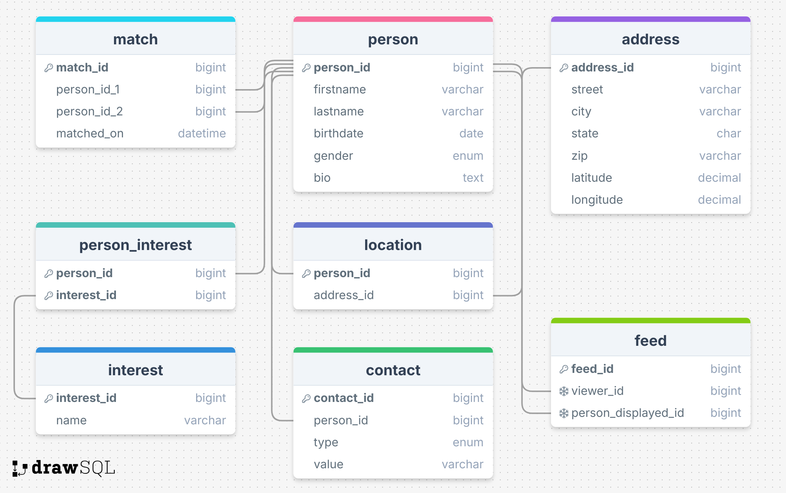

# Dating App

My project models data in a dating app database. It includes profiles, contact information, and matches based on location.



## Query I thought it did well on

**Question**: What should a user do to get more matches?

**GPT SQL Response**:

```sql
SELECT interest.name, COUNT(match.match_id) as match_count
FROM interest
JOIN person_interest
ON interest.interest_id = person_interest.interest_id
JOIN match ON (match.person_id_1 = person_interest.person_id
OR match.person_id_2 = person_interest.person_id)
GROUP BY interest.interest_id
ORDER BY match_count DESC;
```

**Friendly Response**: To increase your matches, consider highlighting your interest in hiking, as it’s the most popular among others. You could also showcase your love for dogs, yoga, music, or cooking, as these interests resonate well with others too. Connecting over shared hobbies is a great way to boost your chances of making meaningful connections!

## Question that it tripped up on

It decided to choose the most attractive person on the app based on number of matches. It did a correct sql query for the number of matches for each person in the database. The problem is it grouped by id and ordered it descending by match count with a limit of 1 person. Even though all four people had one match, this query returned just Diana Miller as 'the most attractive person' on the app.

Question: Who is the most attractive person on this dating app?

**GPT SQL Response**:

```sql
SELECT person.firstname, person.lastname, COUNT(match.match_id)
AS match_count
FROM person
JOIN match
ON person.person_id = match.person_id_1
OR person.person_id = match.person_id_2
GROUP BY person.person_id
ORDER BY match_count
DESC
LIMIT 1;
```

SQL Result is just Diana Miller: [{\"firstname\":\"Diana\",\"lastname\":\"Miller\",\"match_count\":1}]

**Friendly Response**: Certainly! Based on the data, it looks like the most attractive person on the dating app is Diana Miller.

My friend came up with this question, and I thought it was pretty funny. I did not have any idea how the LLM would quantify attractiveness, but measuring based on number of matches was actually pretty smart. The only problem is that the query it used did not account for equal match counts.

I think the query it gave is actually a good attempt since someone with the most matches would technically be found 'attractive' by the most people. It would be better, however, to give a list of users with the highest match counts rather than what it gave as 'most attractive'.

## Few-shot

It actually did worse on this question with the few-shot approach. I think since it did not know how to quantify attractiveness it just used the sql query I gave it for training on the database. This query finds all the males in the database. So technically, it quantified all the males as the most attractive people on the app 😂.

**Question (few-shot)**: Who is the most attractive person on this dating app?

SQL Result is all the males: [{\"firstname\":\"Bob\",\"lastname\":\"Johnson\"},{\"firstname\":\"Charlie\",\"lastname\":\"Brown\"}]

**Friendly Response**: Sure! According to the data, Bob Johnson and Charlie Brown are considered the most attractive people on the dating app.

The few-shot prompt made it way worse for this question. The zero-shot attempt actually gave a plausible method for measuring attractiveness. The few-shot attempt gave an absolutely meaningless response haha.

## Conclusion

I discovered that for questions implicitly related to the data, GPT 4 does a very good job of answering the natural language questions. However, more subjective questions give it trouble as it doesn't know how to interpret them as well. I felt it was pretty effective, but only for people with technical backgrounds.
